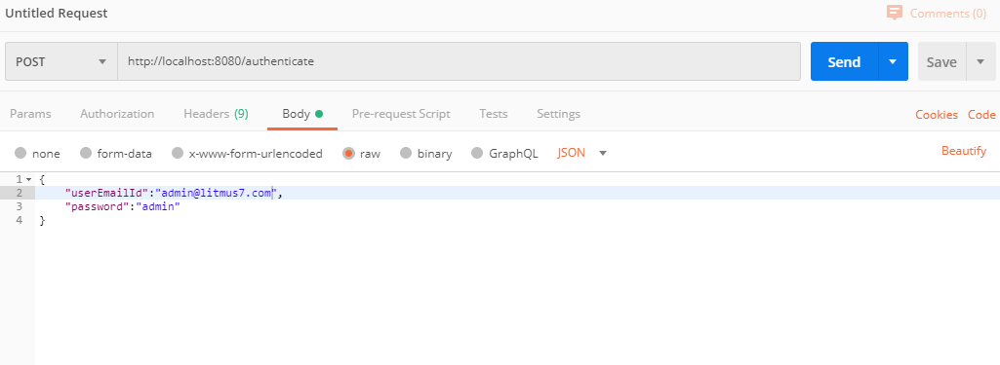
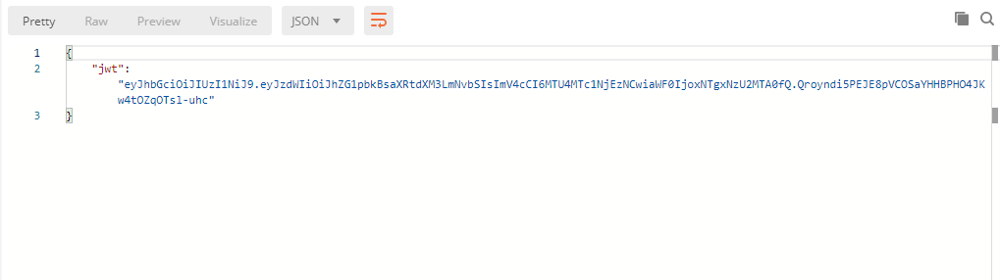
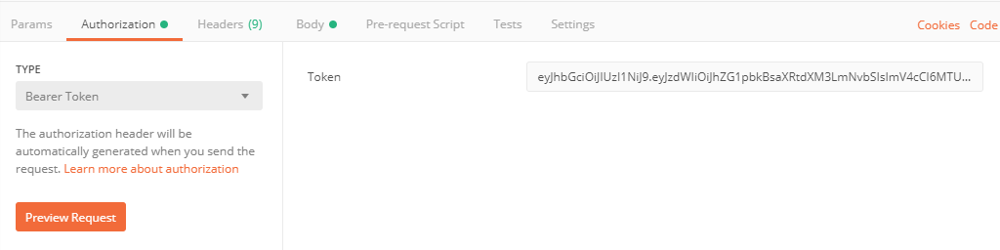
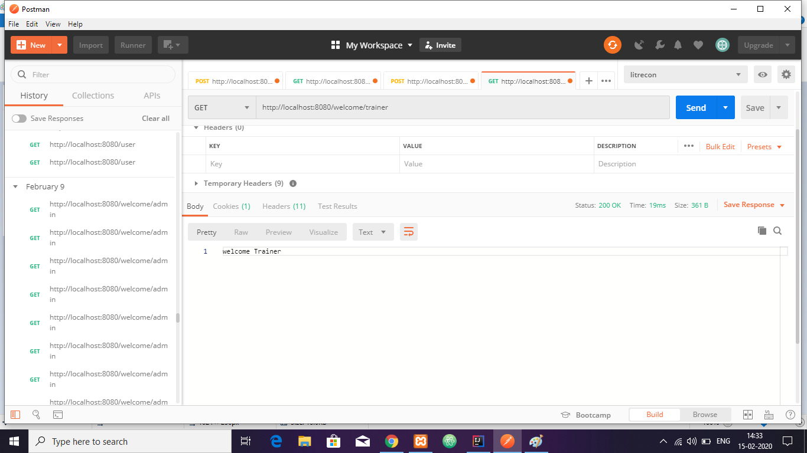

# SpringSecurity-Jwt Token

This is a SpringBoot project which simulates authetication using *jwt token*. As we know jwt token is a self-contained token, which means unlike other authorization mechanism where token is stored(as in case of jdbc token, in memmory token) jwt toekn is based on encryption and decryption. We can configure expire time in jwt token. We can use any of the encryption-decryption algorithms according to use case. For example if there is only a single server on thrive, we could use *HS256* algorithm, where encrytpion and decryption is done using same *secretKey*. In case of microservice environment, we could use *RS256 algorithm* where we will use seperate private key and public key for encryption and decrption where public key will be distributed among different services and private key will be kept with authorization server. Here we have used HS256 algorithm with a single key for encryption and decryption. Following are the major steps which will cover the demostration. 

## Demostration Steps

1. Login using pre-stored credentials( emailid,password). The structure of the login request body has been defined in *dto/AuthenticationRequest*. The pre-configured endpoint for this login is *"/authenticate"*.
  

2. This would return a jwt token, which will contain expire time, username/emailid and what ever details we want to include in ecrypted form.

3.In all subsequest api request, we will add this token to our header, in order to authenticate.
  
  
  

